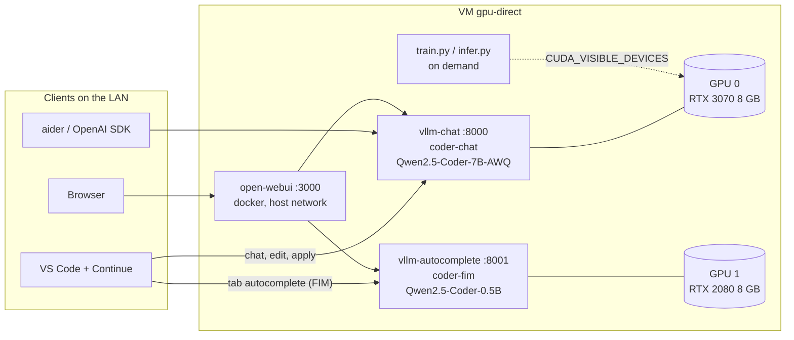

# Architecture and deployment picture

## Layers

```
┌─ pve-node3 (bare-metal Proxmox host, Intel i7-11700F, IOMMU on) ──────────────────────────────┐
│  vfio-pci owns both cards; each is handed to the VM as a whole PCIe device (video + audio fn)    │
│                                                                                                 │
│  ┌─ VM "gpu-direct"  Q35/OVMF, 14 vCPU, 46 GB RAM, 96 GB NVMe, Ubuntu 24.04, driver 580 ──────┐ │
│  │                                                                                            │ │
│  │   01:00.0  RTX 3070 8 GB  ◄── vllm-chat.service          (systemd, user ubuntu)            │ │
│  │                              python `vllm serve` API server ── :8000                       │ │
│  │                              └─ VLLM::EngineCore   (the process that owns the GPU)         │ │
│  │                                 weights 5.4 GB (Qwen2.5-Coder-7B AWQ) + KV cache 1.4 GB    │ │
│  │                                                                                            │ │
│  │   02:00.0  RTX 2080 8 GB  ◄── vllm-autocomplete.service  (25% of the card)                │ │
│  │                              python `vllm serve` API server ── :8001                       │ │
│  │                              └─ VLLM::EngineCore   1.0 GB weights (Coder-0.5B fp16) + KV   │ │
│  │                           ◄── vllm-vision.service        (68% of the card)                │ │
│  │                              python `vllm serve` API server ── :8002                       │ │
│  │                              └─ VLLM::EngineCore   Qwen2.5-VL-3B AWQ (images in, text out) │ │
│  │                                                                                            │ │
│  │   (no GPU)                ◄── open-webui (docker, --network host) ── :3000                 │ │
│  │                              talks to :8000 and :8001 on localhost with the API key        │ │
│  │                                                                                            │ │
│  │   ~/ml/.venv  torch cu128 + transformers/peft/trl   train.py / infer.py  (on demand,       │ │
│  │               pinned to GPU 0 by default; CUDA_VISIBLE_DEVICES=1 to use the 2080)          │ │
│  └────────────────────────────────────────────────────────────────────────────────────────────┘ │
└─────────────────────────────────────────────────────────────────────────────────────────────────┘
        ▲                       ▲                        ▲
   VS Code + Continue      aider / any OpenAI SDK      browser
   chat+edit  -> :8000     -> :8000  (coder-chat)      -> :3000
   autocomplete -> :8001
```



## Who uses which GPU

Each vLLM service is pinned to one card with `CUDA_VISIBLE_DEVICES` in its unit file. GPU 0 is dedicated to the
7B chat model; GPU 1 is shared by two services with fixed memory shares (`--gpu-memory-utilization` 0.25 + 0.68),
so they cannot starve each other. Speech-to-text (Whisper `small`, multilingual, auto language detection) runs on
the CPU inside the Open WebUI container: about 2 s per utterance on 14 vCPUs; set `WHISPER_MODEL=medium` for
better accuracy at ~5 s.
Measured on a running system (`nvidia-smi --query-compute-apps`):

| GPU | PCI | Card | Process holding the GPU | Parent service | VRAM in use | Of which |
|---|---|---|---|---|---|---|
| 0 | 01:00.0 | RTX 3070 (Ampere) | `VLLM::EngineCore` (child of `vllm serve`, pid 900) | vllm-chat | 7.66 GB | 5.4 GB weights (7B AWQ 4-bit) + 1.4 GB KV cache + 0.3 GB activations/graphs |
| 1 | 02:00.0 | RTX 2080 (Turing) | `VLLM::EngineCore` (child of `vllm serve`) | vllm-autocomplete | 25% of the card (1.9 GB) | 1.0 GB weights (0.5B fp16) + ~0.6 GB KV cache |
| 1 | 02:00.0 | RTX 2080 (Turing) | `VLLM::EngineCore` (child of `vllm serve`) | vllm-vision | 68% of the card (5.2 GB) | Qwen2.5-VL-3B AWQ: ~1.8 GB LLM + ~1.2 GB vision tower + KV |

What that buys you:

| | chat (GPU 0) | autocomplete (GPU 1) |
|---|---|---|
| model | Qwen2.5-Coder-7B-Instruct, AWQ | Qwen2.5-Coder-0.5B base (FIM-trained) |
| context per request | 16,384 tokens | 8,192 tokens |
| KV cache capacity | 27k tokens ≈ 1.6 requests at full context | see service log at start-up |
| max concurrent sequences | 8 | 16 |
| single-stream speed | 81 tok/s | 48-token completion in ~350 ms |
| dtype | int4 weights, fp16 compute | fp16 (Turing has no bf16) |

Why this split: the 3070 is the faster card and the only Ampere one, so it gets the big model; a 7B model in 4-bit
leaves just enough room for a 16k-token context. Autocomplete needs latency, not capacity: a 0.5B model on the
older 2080 answers in well under half a second, which leaves room on the same card for the vision model.

Each `vllm serve` is two processes: the API server (HTTP, tokenisation, scheduling; ~1.3 GB RAM) and
`VLLM::EngineCore` (model execution; owns the CUDA context and all VRAM). Open WebUI has no GPU: it is a plain
web app that forwards to the two endpoints. Training scripts are run by hand and take whichever GPU
`CUDA_VISIBLE_DEVICES` names; running `train.py` on GPU 1 while the services are up will fail for lack of VRAM,
so stop `vllm-autocomplete` first (`sudo systemctl stop vllm-autocomplete`) or train on a card you free up.

## Edge (optional layer, `serving/install_edge.sh`)

| Component | Listens | Role |
|---|---|---|
| dnsmasq | `<VM_IP>:53` | authoritative for `*.skyops.lan` -> VM (clients add the VM as resolver for that zone) |
| avahi | mDNS on the LAN interface | `gpu-direct.local` for hosts on the same L2 segment |
| Caddy | `:443` (+ `:80` redirect) | TLS with its own CA (`local_certs`): `coder.` -> :3000, `api.` -> :8000, `fim.` -> :8001, `vision.` -> :8002 |

The CA root is exported to `~/skyops.lan-root.crt` on the VM; clients trust it once. The plain-HTTP ports stay open.

## Network and security

* All three ports listen on `0.0.0.0` inside the VM; the VM is on a private LAN (no public exposure).
* Both vLLM endpoints require `Authorization: Bearer <VLLM_API_KEY>` (key in `/etc/vllm.env`, mode 640).
* Open WebUI has its own login (first visitor becomes admin) and stores chats in the `open-webui` docker volume.
* Nothing is TLS-terminated; put a reverse proxy in front if you ever expose it beyond the LAN.

## Storage layout on the VM

| Path | Size | Content |
|---|---|---|
| `~/.cache/huggingface/hub` | ~17 GB | model weights (Coder-7B-AWQ, Coder-0.5B, VL-3B-AWQ, plus 0.5B/1.5B-Instruct used for training) |
| `~/vllm/.venv` | 7.7 GB | vLLM 0.28 + torch 2.13 cu130 (serving) |
| `~/ml/.venv` | 7.0 GB | torch 2.11 cu128 + transformers 5 / peft / trl (training) |
| `~/ml/outputs/lora` | small | adapters produced by `train.py` |
| `/etc/vllm.env` | | API key and model names read by both units |
| docker volume `open-webui` | | web UI users and chat history |

Two separate virtualenvs on purpose: vLLM pins its own torch build; keeping it apart from the training stack
means neither upgrade can break the other.

## Boot sequence

systemd starts `vllm-chat` and `vllm-autocomplete` after the network; each loads its model (about 60 s for the
7B, ~20 s for the 0.5B, ~40 s for the vision model) and then answers on its port. Docker restarts `open-webui` (`--restart unless-stopped`).
Verified: after `sudo reboot`, all three endpoints were back without intervention.

## How it got here (short version)

The first two VMs the provider gave us could never initialise a GPU: they were OpenStack instances running inside a
Proxmox VM, so the GPU crossed two hypervisors and its firmware could not DMA from guest memory. The full
investigation, including the driver-source evidence, is in `gpu-passthrough-troubleshooting.md`. The VM described
above is attached directly to the bare-metal host and worked on the first try.
